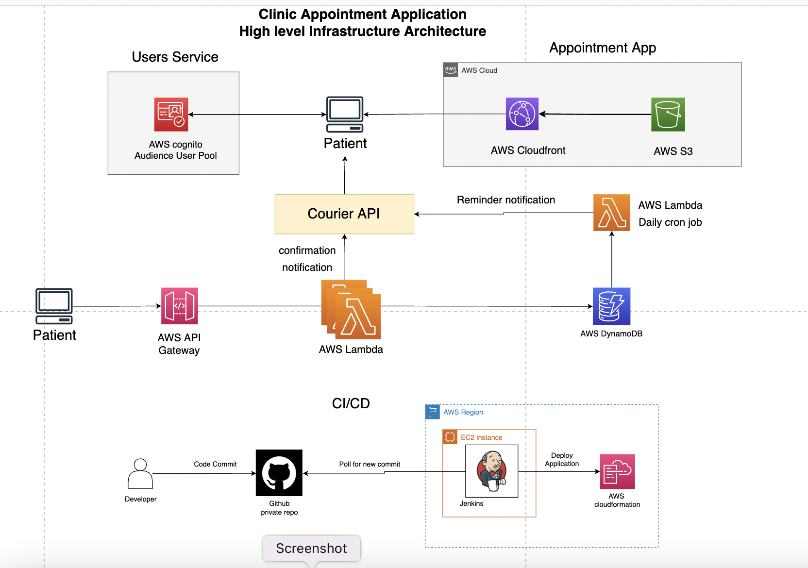

# clinic-appointment-booking
A simple appointment booking serverless full stack application demonstrating the use of courier API. Allows people to book appointments with doctors and notifies the patient and doctor about the confirmation of the appointment using the courier API. At the day of appointment sends reminder emails in morning to patient and doctor thus automating the process.

**High level infrastructure architecture**

    

Frontend is built using react, deployed to AWS S3 and distributed to CDN via AWS cloudfront. Uses AWS Cognito for managing user pool and authentication. Backend is built using python, deployed on AWS Lambda, uses DynamoDB as database. uses AWS cloudwatch and AWS Xray for monitoring. Application tech stack deployed using AWS cloudformation. Uses Jenkins for CI/CD. Uses Courier API to send notifications to patients and doctors.

## Demo

[Appointment booking application](https://d10j1cxwbljaix.cloudfront.net/)

## Backend

Back-end services that makes up the Serverless Appointment booking functionality functionalities as of now:

Service | Language | Description
------------------------------------------------- | ------------------------------------------------- | ---------------------------------------------------------------------------------
[Appointments](./backend/appointments/) | python | CRUD operations for creating appointments.

## Frontend

Frontend uses react with typescript.

Service | Language | Description
------------------------------------------------- | ------------------------------------------------- | ---------------------------------------------------------------------------------
[Audience](./frontend/audience/) | React-Typescript | Application to test ad campaigns for authenticated users.

## Project structure

    backend
    ├── appointment
    frontend
    └── audience
    pipeline

## Technologies used

* HTML, Material-ui, Typescript, ReactJS
* Python
* Courier API
* Jenkins
* AWS (Lambda, dynamoDB, S3, API gateway, cloudformation, Cognito, CloudFront)

## Running the application

### Requirements
python >= 3.9.0 , [SAM CLI](https://docs.aws.amazon.com/serverless-application-model/latest/developerguide/serverless-sam-cli-install.html) >= version 0.50.0,
AWS CLI is setup and configured, see[aws config setup](https://docs.aws.amazon.com/cli/latest/userguide/cli-configure-files.html)

### Build and Deploy 

For creating a user to deploy the application, see [this](./pipeline/jenkinsIAMUser.yml) template.

Export auth token for courier API as envrionment variable

    export COURIER_AUTH_API_TOKEN=YOUR_COURIER_AUTH_TOKEN_HERE

Courier assigns you an "Auth Token" when you Register your account. You can retrieve this token from any of the [Notification](https://app.courier.com/designer/notifications) detail pages.

To build and deploy the application, in terminal run make command, this will build the backend and push it to cloud first then build frontend and push it to the cloud.

    make

While running for first time if the above command does not work run

    sam deploy --guided

When the make command has executed successfully at the end it will print the cloudfront url of the frontend app.